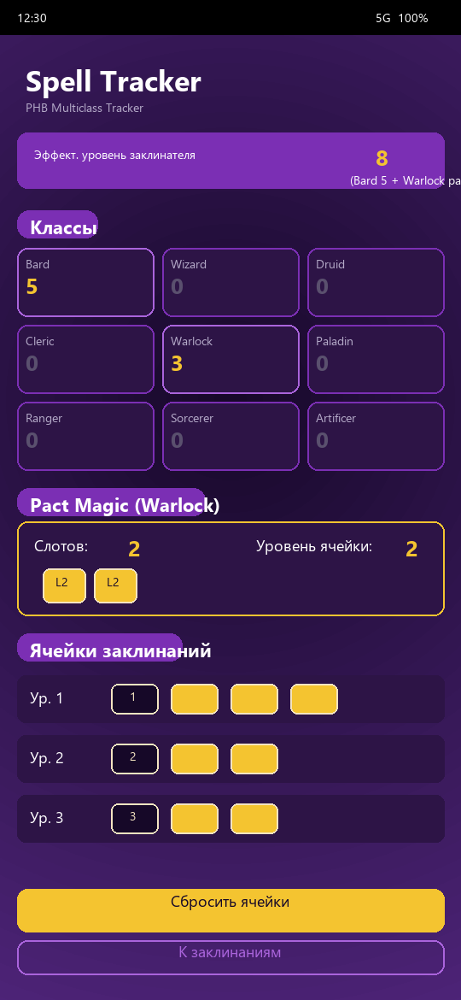
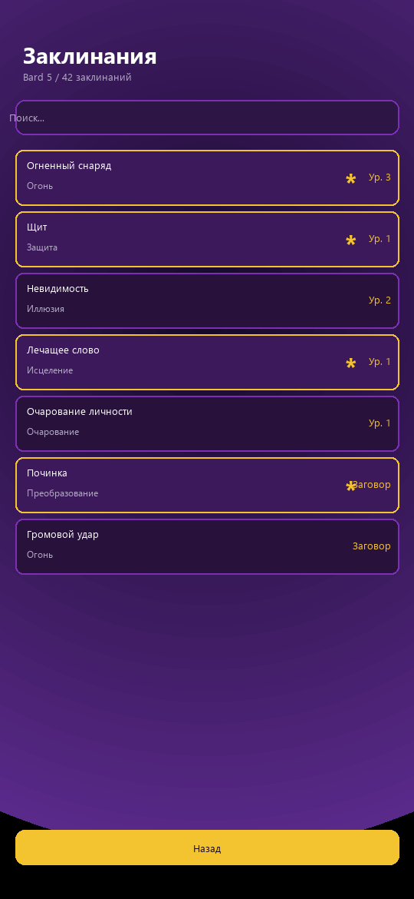
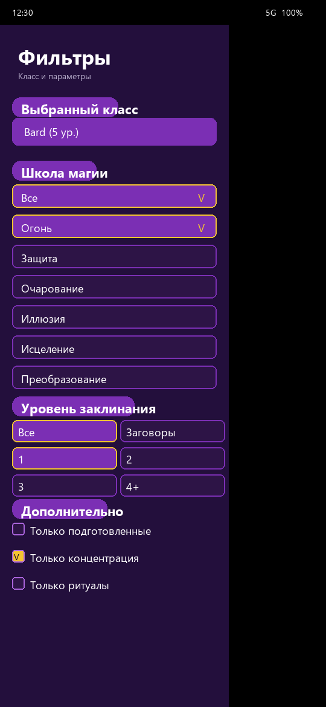

<div align="center">

# 🪄 Spell Tracker

**Android-приложение для отслеживания ячеек заклинаний D&D 5e по правилам PHB**

[](https://github.com/SiberianFoboZ/spell-tracker-dnd/releases/tag/v2.4.2)
[](LICENSE)
[](https://developer.android.com)
[](https://kotlinlang.org)
[](https://developer.android.com/jetpack/compose)

</div>

---

## Что это

**Spell Tracker** — минималистичный помощник для магов D&D 5e: показывает текущее
состояние ячеек заклинаний, пакт-магии и арканумов в одном экране. Никаких аккаунтов,
аналитики и интернета — только локальные данные, которые переживают рестарт приложения.

Текущая версия: **v2.5.2** — фикс длинного отдыха + редизайн ряда кастомных ячеек.

---

## 🆕 Что нового в v2.5.0

### 👥 Мульти-персонажи
- **Свайп влево** на главном экране → список персонажей. Переключение с **полным сохранением состояния** каждого: классы, ячейки (обычные / пакт / арканумы), кастомные ячейки, подготовленные заклинания.
- **Long-press** по строке персонажа → модалка редактирования: имя (текст переживает закрытие) + удаление. Авто-фокус и клавиатура сразу при открытии.
- Данные каждого персонажа хранятся отдельным блобом в `SharedPreferences`. При первом запуске существующее состояние мигрирует в «Персонаж 1».

### 🔮 Динамические ячейки (Этап 21)
- `total 1..5` → **1 ряд** обычных ячеек (48dp)
- `total 6..10` → **2 ряда** уменьшенных ячеек (38dp, ≈80%)
- `total 11..20` → **числовой диапазон** `remaining / total` (счётчик отнимается, не прибавляется)
- `CustomSlot.total` поднят с 10 до **20**
- Новый тип кубика `★` для **ультимативных способностей** без объёма

### 🔐 Подпись release APK
- Личный `keystore` (RSA 2048, 10000 дней) вместо дебажного ключа — больше нет предупреждения «подписано отладочным ключом» при установке.
- **GitHub Actions** при `push` тега `v*` декодирует keystore из Secrets, подписывает APK, верифицирует подпись `apksigner`'ом и прикрепляет к GitHub Release.
- Скрипты: `tools/generate_keystore.ps1` (создать) + `tools/encode_secrets.ps1` (обновить Secrets).

### 🎬 Плавные переходы
- Все экраны теперь переключаются с **slide + fade** анимацией (300мс) — резких скачков больше нет.

---

## ✨ Возможности

### 📚 Классы
- **9 классов D&D 5e** (PHB + XGE): Бард, Жрец, Друид, Паладин, Следопыт, Чародей, Колдун, Волшебник, Изобретатель
- **Мультикласс**: можно добавить любое количество классов со своими уровнями
- Количество ячеек считается **автоматически** по классу и уровню (без ручного ввода «у меня 3 первого уровня»)

### 🔮 Ячейки заклинаний
- **9 уровней заклинаний** для каждого кастера
- Тап по ячейке → пометить как использованную
- Восстановление по кнопкам **«Длинный отдых»** / **«Короткий отдых»** внизу экрана

### 🟣 Магия договора (отдельный блок)
- Для **Колдуна** пакт-магия вынесена в отдельный блок
- Восстанавливается **на коротком отдыхе** (по PHB)
- Цветовая пометка отличается от обычных ячеек

### 🟡 Арканумы (отдельный блок)
- Заклинания **VI–IX уровня** для Колдуна
- Открываются **с 11 уровня** Колдуна: 11/13/15/17 → 1/2/3/4 арканума
- Восстанавливаются **только на длинном отдыхе** (по PHB)
- Весь блок скрыт, если Колдун не выбран

### 📖 Каталог заклинаний
- Встроенная **база заклинаний** на Room (локально, без интернета)
- Экран **Spells** с фильтрацией по уровню, школе, классу
- Экран **SpellDetail** с полным описанием, компонентами, длительностью

### 💾 Сохранение
- Классы, уровни и потраченные ячейки **сохраняются** между сессиями
- Данные — только локально (SharedPreferences для состояния, Room для базы заклинаний)
- Без трекинга, без аналитики, без рекламы

---

## 📸 Скриншоты

<div align="center">

| Главный экран | Список заклинаний | Боковое меню |
|:---:|:---:|:---:|
|  |  |  |
| Ячейки, пакт-магия, арканумы | Каталог с фильтрами | Выбор классов |

</div>

ASCII-схема главного экрана для мультикласса Wizard 9 + Warlock 5:

```
┌─────────────────────────────────────────┐
│ Spell Tracker                           │
├─────────────────────────────────────────┤
│ Классы:  Bard 1  Cleric 3  Wiz 9  ...  │
├─────────────────────────────────────────┤
│ МАГИЯ ДОГОВОРА                  Колдун   │  ← (если warlockLevel > 0)
│   V  ▮▮▮▮▮  (2/2)                       │
├─────────────────────────────────────────┤
│ ЯЧЕЙКИ ЗАКЛИНАНИЙ                       │
│   I    ▮▮▮▮ (4/4)   IV  ▮▮▮  (3/3)      │
│   II   ▮▮▮  (3/3)   V   ▮▮   (2/2)      │
│   III  ▮▮   (2/2)                      │
├─────────────────────────────────────────┤
│ АРКАНУМЫ                                │  ← (если warlockLevel ≥ 11)
│   VI  ▮ (1/1)    VII ▮ (1/1)            │
│   VIII▮ (1/1)    IX  ▮ (1/1)            │
├─────────────────────────────────────────┤
│ [ Длинный отдых ]  [ Короткий отдых ]   │
└─────────────────────────────────────────┘
```

---

## 🏗 Стек

| Слой | Технология |
|------|-----------|
| Язык | **Kotlin 2.0.21** |
| UI | **Jetpack Compose** (BOM 2024.10.01) + **Material 3** |
| Состояние | **Lifecycle 2.8.7** + `StateFlow` / `SharedFlow` |
| Навигация | **Navigation Compose 2.8.4** |
| Локальная БД | **Room 2.6.1** (каталог заклинаний) + **SharedPreferences** (стейт) |
| Сборка | **AGP 9.1.1** + Gradle + KSP |
| Min SDK | **24** (Android 7.0) |
| Target SDK | **36** (Android 16) |
| Java | **17** |

**Никаких сторонних зависимостей сверх AndroidX / Compose / Room.** Архитектура — single-Activity + Compose Navigation + MVVM.

---

## 🏛 Структура проекта

```
app/src/main/java/com/example/spelltracker/
├── MainActivity.kt              # Single-Activity host (Compose)
├── data/
│   ├── Classes.kt               # Определения 9 классов
│   ├── ClassFilter.kt           # Логика фильтрации классов
│   ├── Spell.kt                 # Модель заклинания
│   ├── SpellDao.kt              # Room DAO
│   ├── SpellDatabase.kt         # Room @Database
│   ├── SpellParser.kt           # Парсинг сырых данных
│   ├── SpellRepository.kt       # Репозиторий заклинаний
│   └── SpellStorage.kt          # SharedPreferences + StateFlow
├── ui/
│   ├── detail/                  # Экран деталей заклинания
│   ├── home/                    # Главный экран (ячейки, пакт, арканумы)
│   │   ├── HomeScreen.kt        # 3 секции: Пакт → Ячейки → Арканумы
│   │   └── HomeViewModel.kt     # HomeState + HomeEvent (Flow + Combine)
│   ├── nav/AppNavigation.kt     # Compose Navigation graph
│   ├── spells/                  # Экран списка заклинаний
│   └── theme/                   # Color, Theme, Type (Material 3)
└── res/values/strings.xml       # Все строки UI (i18n-ready)
```

**Ключевые паттерны:**

- **MVVM** — `HomeViewModel` собирает `StateFlow` через `combine(...)` → `HomeState` → `HomeScreen`
- **Conditional rendering** — `if (warlockLevel == 0) return` секции рендерятся только при наличии данных
- **Single source of truth** — `SpellStorage` хранит state в SharedPreferences, реплицирует в `StateFlow` для реактивного UI
- **Reactive UX** — `animateColorAsState`, `animateDpAsState`, haptic feedback на тапах

---

## 🔨 Сборка

### Требования
- **JDK 17**
- **Android SDK** с platform `android-36` и build-tools для AGP 9.1.1
- Интернет для первой загрузки зависимостей (Gradle)

### Команды

```bash
# Клонировать
git clone https://github.com/SiberianFoboZ/spell-tracker-dnd.git
cd spell-tracker-dnd

# Сборка release APK
./gradlew assembleRelease
# → app/build/outputs/apk/release/spell-tracker-v2.4.2.apk
```

Windows:

```powershell
.\gradlew.bat assembleRelease
```

### Установка на устройство

```bash
adb install -r app/build/outputs/apk/release/spell-tracker-v2.4.2.apk
```

### Подпись release APK (Этап 23)

Release-APK подписывается **личным keystore** (`keystore/spell-tracker-release.jks`),
а не дебажным ключом — так при установке на устройство нет предупреждения
«подписано отладочным ключом» / «не из безопасных источников».

Если файла `keystore.properties` нет, build падает обратно на debug-keystore
(для обратной совместимости).

**Сгенерировать keystore + keystore.properties впервые** (Windows, PowerShell):

```powershell
.\tools\generate_keystore.ps1
```

Это создаст:
- `keystore/spell-tracker-release.jks` (RSA 2048, срок 10000 дней)
- `keystore.properties` (alias + пароли)

Оба файла добавлены в `.gitignore` — реальные пароли **не должны** попадать в репозиторий.
Для совместной разработки передавайте `keystore.properties` (и при необходимости сам
keystore) **отдельно** от кода (по защищённому каналу), либо используйте
`keystore.properties.example` как шаблон для своей генерации.

**Ручная генерация** (если нужен свой alias/пароль/DN):

```powershell
keytool -genkeypair -v `
    -keystore keystore\spell-tracker-release.jks `
    -alias spell-tracker `
    -keyalg RSA -keysize 2048 -validity 10000 `
    -storepass ВАШ_ПАРОЛЬ_ХРАНИЛИЩА `
    -keypass ВАШ_ПАРОЛЬ_КЛЮЧА `
    -dname "CN=Spell Tracker, OU=Personal, O=vk241, C=RU"
```

> ⚠️  Если на устройстве уже стоит APK, подписанный другим ключом (например,
> старый debug-APK), обновление поверх **не получится** из-за разных подписей.
> Перед установкой нового APK нужно удалить старую версию (`adb uninstall`
> com.example.spelltracker или вручную).

---

## 📜 История релизов

| Версия | Что нового | Дата |
|--------|-----------|------|
| **v2.5.2** | longRest теперь сбрасывает ВСЕ кастомные ячейки; ряд кастомных ячеек — как у pact magic (бейдж 56dp, заголовок 16sp) | 2026-07-02 |
| **v2.5.1** | Фикс: кастомные ячейки сбрасываются на отдыхе + Auto-Backup | 2026-07-02 |
| **v2.5.0** | Мульти-персонажи + динамические ячейки + подпись release APK | 2026-07-02 |
| v2.4.2 | Скрытие блока «АРКАНУМЫ» при `warlockLevel == 0` | 2026-06-13 |
| v2.4.1 | Блок «Магия договора» вынесен отдельно (откат объединения) | 2026-06-13 |
| v2.4.0 | Арканумы Колдуна (VI–IX), отдельный блок | 2026-06-13 |
| v2.3.0 | UX-редизайн: крупные ячейки, haptic feedback, анимации | 2026-06 |
| v2.2.0 | Полный мультикласс, 9 классов | 2026-05 |
| v2.1.1 | Исправления в подсчёте ячеек | 2026-05 |
| v2.1.0 | Пакт-магия Колдуна, 8 классов | 2026-05 |
| v2.0.0 | Полная переработка: Kotlin + Jetpack Compose | 2026-04 |
| v1.1.0 | Поддержка 5 классов | 2026-03 |
| v1.0.0 | Первый релиз (Java + XML) | 2026-02 |

Все релизы: [github.com/SiberianFoboZ/spell-tracker-dnd/releases](https://github.com/SiberianFoboZ/spell-tracker-dnd/releases).

---

## 🤝 Contributing

PR и баг-репорты приветствуются — откройте issue перед крупными изменениями.

### Добавить новый класс

1. Откройте `data/Classes.kt` и добавьте новый `ClassDef` со всеми полями
2. Добавьте PHB/XGE-таблицу прогрессии в слот-калькулятор
3. Добавьте отображение класса в `HomeScreen` (если нужна особая логика отдыха)
4. Запустите `./gradlew test` — тесты на PHB-таблицы должны пройти

### Архитектурные правила

- **Состояние** — только в `SpellStorage` (Single source of truth)
- **Composable** — без побочных эффектов; побочки — в `LaunchedEffect` / `ViewModel`
- **Строки** — все в `res/values/strings.xml`, никаких хардкодов в UI

---

## 📋 Планы

- [ ] Снапшот сессии (экспорт / импорт)
- [ ] Dynamic Color (Material You) на Android 12+
- [ ] Локализация: английский, украинский
- [ ] Публикация в Google Play (с собственным keystore)

---

## ⚖️ Юридическое

**Spell Tracker** — неофициальный фанатский проект. **Dungeons & Dragons** и связанные
термины (PHB, XGE, арканумы, пакт-магия и т.д.) — товарные знаки **Wizards of the Coast LLC**.
Этот проект использует материалы **System Reference Document 5.1** по лицензии
**Creative Commons Attribution 4.0 International License (CC BY 4.0)**.

Исходный код приложения распространяется по лицензии [MIT](LICENSE).

---

## 🙏 Благодарности

- **Wizards of the Coast** — за D&D 5e SRD, без которого этот проект не существовал бы
- **Google / JetBrains** — за Kotlin, Jetpack Compose и Android-экосистему
- Всем, кто играл тестовые сессии и давал обратную связь

---

<div align="center">

🪄 **Магия — это просто расписание ячеек. Следите за ними, а герои — за вами.**

*Сделано с ☕ и 20-гранником.*

</div>
